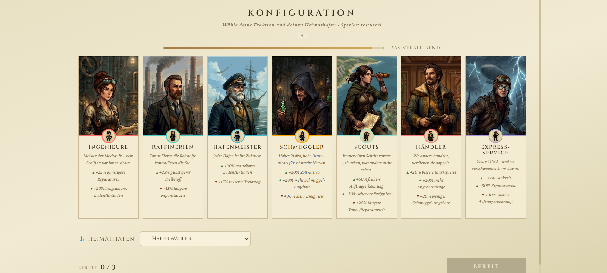

## Worum es geht

Die Weltmeere sind hart umkämpft: Wer hier Geld verdienen will, braucht das richtige Schiff zur richtigen Zeit, ein Gespür für lohnende Fracht und Nerven, wenn ein Sturm aufzieht oder der Zoll an Bord kommt.

**Crowns of the Seas** ist ein webbasiertes Wirtschafts-Strategiespiel, in dem bis zu vier Spieler:innen gleichzeitig konkurrierende Reedereien leiten. Alle teilen sich dieselbe Spielwelt, denselben Markt und dieselben Häfen – und kämpfen in Echtzeit um die profitabelsten Aufträge. Inspiriert vom Klassiker *Ports of Call*, ist das Spiel keine museale Kopie, sondern eine eigenständige, moderne Neuinterpretation für den Browser.

Im Mittelpunkt steht bewusst nicht aufwendige 3D-Grafik, sondern eine lebendige, **strategische Wirtschaftssimulation** aus Handel, Logistik, Risiko und direkter Konkurrenz.

## Das Ziel

Klassische Wirtschaftssimulationen sind oft Einzelspieler-Erlebnisse: Man spielt gegen den Computer, in seiner eigenen abgeschotteten Welt. Crowns of the Seas verfolgt ein anderes Ziel – **gemeinsamer Wettbewerb in Echtzeit**:

- Mehrere Spieler:innen in **einer geteilten Session**, die wirklich aufeinandertreffen: gleicher Markt, gleiche Häfen, gleiche Ereignisse.
- Ein **faires Spielfeld**, auf dem alle unter exakt denselben Bedingungen antreten und niemand tricksen kann.
- Eine Wirtschaft, die sich **glaubwürdig und spannend** anfühlt, ohne dass man ein Handbuch lesen muss.

**Für wen ist das interessant?** Für Spieler:innen, die Aufbau- und Wirtschaftsstrategie mögen und dabei gegen echte Gegner antreten wollen – und für ein Informatik-Publikum als anschauliches Beispiel, wie sich ein reichhaltiges, mehrspielerfähiges Echtzeit-Erlebnis im Browser umsetzen lässt.

## Was das Spiel besonders macht

### Echtes Multiplayer in einer geteilten Welt

Jede Spielsession ist eine gemeinsame Bühne: Bis zu vier Reedereien bewegen sich über **dieselbe Weltkarte mit neun Häfen** – von Hamburg über New York und Santos bis Singapur, Shanghai und Sydney. Die Schiffe der Konkurrenz sind dabei jederzeit **auf der Karte sichtbar**. Das macht den Wettbewerb unmittelbar erfahrbar: Man sieht, wohin die Gegner steuern, und kann darauf reagieren. Ein synchronisiertes Zeitmodell (ein Spieltag pro Tick) sorgt dafür, dass alle im selben Rhythmus spielen.


### Sieben Fraktionen, sieben Spielstile

Das strategische Herzstück: Zu Beginn wählt jede:r eine von **sieben Fraktionen** – etwa Scouts, Ingenieure, Raffinerien, Hafenmeister, Schmuggler, Händler oder Quick-Service. Jede Fraktion verändert das Spielgefühl spürbar. Scouts erkennen Gefahren früher und fahren ruhigere Routen, während andere Fraktionen schneller be- und entladen, günstiger tanken oder reparieren.

Der Clou: Keine Fraktion ist einfach „besser". Jede hat **Stärken und bewusste Schwächen** – wer früh Gefahren ausweicht, zahlt das an anderer Stelle mit längeren Servicezeiten. Das eröffnet echte strategische Entscheidungen schon vor dem ersten Auftrag und sorgt für hohen Wiederspielwert.



### Eine Wirtschaft mit Tiefe

Geld verdient man über zwei zentrale Märkte, die allen Spieler:innen gleichzeitig offenstehen:

- **Die Frachtbörse** generiert laufend neue Aufträge, die sich in Strecke, Dauer, Volumen, Gewinnspanne und Risiko unterscheiden. Angenommen werden kann ein Auftrag nur im jeweiligen Herkunftshafen – wer dort als Erstes ist, gewinnt.
- **Die Schiffsbörse** bietet Schiffe in drei Klassen: von der günstigen, störanfälligen Billigklasse über solide Mittelklasse bis zur teuren Topklasse mit hoher Kapazität. Kaufen und Verkaufen ist jederzeit möglich.

Dazu kommen Routenplanung mit Lotsen- und Betriebskosten sowie eine Regresskontrolle bei Schäden – Bausteine, die zusammen ein nachvollziehbares, forderndes Wirtschaftsgefühl ergeben.


### Eine Welt, die zurückschlägt

Damit keine Reise Routine wird, hält die Spielwelt **Zufallsereignisse** bereit – einige davon werden zu kleinen, geschicklichkeitsbasierten **Minispielen**:

- **Lotsenstreik** → das Schiff muss von Hand an- und abgelegt werden (Docking-Minispiel)
- **Eisberge, Sandbänke, Treibgut** → manuelles Navigieren durch Hindernisse
- **Sturmtief** → Ausweichen und sammeln im Sturm
- **Ratten an Bord** → ein eigenes Minispiel zur Schädlingsbekämpfung
- **Schmuggel & Zoll** → das riskante Angebot, zusätzlich verbotene Ware mitzunehmen, inklusive Zollkontrolle, möglicher Strafe und der Option, den Zoll zu bestechen – mit ungewissem Ausgang

So entsteht ständige Spannung: Jede Fahrt kann glatt verlaufen – oder plötzlich Geschick und schnelle Entscheidungen verlangen.


### Ein Spiel, das sich lebendig anfühlt

Gerade weil im Hintergrund eine ernsthafte Simulation läuft, legt Crowns of the Seas Wert auf ein **reaktives, atmosphärisches Spielerlebnis**:

- **In-Game-Chat** für die direkte Kommunikation innerhalb der Session.
- **Live-Feedback**, wenn jemand beitritt oder die Session verlässt – und ein sauberes Wiederbeitreten nach Verbindungsabbrüchen.
- **Leaderboard & Ranking** mit ständigem Überblick über Kontostand und Platzierung aller Reedereien.
- **Musik & Soundeffekte** mit weichen Übergängen zwischen den Szenen (Lobby, Spiel, Minispiele) und eigenen Audio-Einstellungen.
- **Cinematic Intro und Animationen** – von der Einstiegssequenz über das Ablegen bis zum animierten Game-Over-Bildschirm mit Siegerpodest.

::: {.callout-tip}
Diese vielen kleinen Rückmeldungen – sehen, hören, lesen – sorgen dafür, dass sich das Spiel trotz der nüchternen Wirtschaftslogik im Hintergrund lebendig und unmittelbar anfühlt.
:::

## Wie es funktioniert

Hinter dem Spiel steckt bewusst kein einzelner Block aus „Frontend plus Backend", sondern ein **verteiltes System** aus mehreren eigenständigen Diensten, die über klare Schnittstellen zusammenspielen.

```{mermaid}
flowchart TB
    subgraph Client["🖥️ Browser"]
        Frontend["Spieloberfläche & Weltkarte"]
    end
    subgraph Auth["🔐 Auth-Service"]
        AuthApp["Login & Registrierung"]
    end
    subgraph Game["⚙️ Spiel-Server"]
        GameApp["Spiellogik, Markt, Ereignisse"]
    end
    Frontend -- "Login" --> AuthApp
    Frontend -- "Aktionen" --> GameApp
    Frontend -- "Echtzeit-Updates" --> GameApp
```

Drei Designentscheidungen prägen das Erlebnis – jeweils mit konkretem Nutzen:

- **Die Spiellogik liegt auf dem Server, nicht im Browser.** Alle wichtigen Entscheidungen, Marktbewegungen und Zufallsereignisse werden zentral berechnet und geprüft. *Der Vorteil:* Schummeln ist praktisch ausgeschlossen, und alle Spieler:innen sehen denselben, konsistenten Spielzustand.
- **Echtzeit statt Nachladen.** Schiffspositionen, Marktänderungen und Ereignisse werden den Clients aktiv zugeschickt, statt ständig abgefragt zu werden. *Der Vorteil:* Die geteilte Welt wirkt unmittelbar und flüssig.
- **Anmeldung als eigener Dienst.** Registrierung und Login sind sauber von der Spiellogik getrennt. *Der Vorteil:* Mehr Sicherheit und ein klar gegliedertes System, an dem im Team parallel gearbeitet werden kann.

Zum Einsatz kommt ein moderner, praxisnaher Technologie-Stack:

| Bereich | Technologien |
|---|---|
| **Oberfläche** | React + TypeScript, Phaser (Weltkarte & Minispiele) |
| **Spiel-Server & Anmeldung** | Java mit Spring Boot, Echtzeit über WebSocket, Anmeldung per JWT |
| **Datenhaltung** | PostgreSQL |
| **Build & Betrieb** | Docker, automatisierte CI/CD-Pipeline |

### Wie tief die Simulation geht

Ein gutes Beispiel für die Detailtiefe ist der Lebenszyklus eines einzigen Schiffs: Es befindet sich zu jedem Zeitpunkt in genau einem klar definierten Zustand – und wechselt diesen je nach Spielgeschehen.

```{mermaid}
stateDiagram-v2
    [*] --> AnDerBörse
    AnDerBörse --> ImHafen: Kauf
    ImHafen --> Beladen: Frachtauftrag
    Beladen --> Unterwegs: Ablegen
    Unterwegs --> Treibend: Schaden
    Treibend --> Unterwegs: Reparatur
    Unterwegs --> Entladen: Ankunft
    Entladen --> ImHafen: Abrechnung
    ImHafen --> Blockiert: Zollkontrolle
    Blockiert --> ImHafen: freigegeben
    ImHafen --> AnDerBörse: Verkauf
```

## Was bisher erreicht wurde

Crowns of the Seas ist bereits als **lauffähiges Multiplayer-Spiel** spielbar. Die komplette Kernschleife steht:

- Session mit bis zu vier Spieler:innen auf einer geteilten Weltkarte mit neun Häfen
- Frachtbörse mit Auftragsannahme im Herkunftshafen und Abrechnung im Zielhafen
- Schiffsbörse mit Kauf und Verkauf über drei Schiffsklassen
- Routen- und Reiseplanung mit Kosten, Dauer und Alternativrouten
- Fraktionssystem mit sieben unterschiedlichen Spielstilen
- Zufallsereignisse inklusive mehrerer Minispiele
- Schmuggel mit Zollkontrolle, Strafe und Bestechungsoption
- Live-Features: Chat, Leaderboard, sichtbare Konkurrenzschiffe, Sound und Animationen


## Ausblick

Das Spiel wächst weiter. Aktuell in Arbeit sind:

- **Benutzerverwaltung** – Profil bearbeiten und Account löschen
- **Ein geführtes Tutorial in der Lobby**, das neue Spieler:innen vor dem ersten Spiel an die Mechaniken heranführt
- **Ein In-Game Help Center** mit Fragen und Antworten, das jederzeit aufrufbar ist – gedacht als optionale Hilfe: Wer sich auskennt, spielt einfach weiter, Einsteiger:innen schlagen bei Bedarf nach

Längerfristig denkbar sind weitere Fraktionen und Minispiele, ein optionaler Computergegner sowie ein Ausbau der Bank rund um Kredite und Hypotheken.

## Links & Ressourcen

- **Repository:** <!-- TODO: Link zum Repository einfügen -->
- **Live-Demo / Demonstrator:** <!-- TODO: Link oder QR-Code zum lauffähigen Demonstrator einfügen -->
