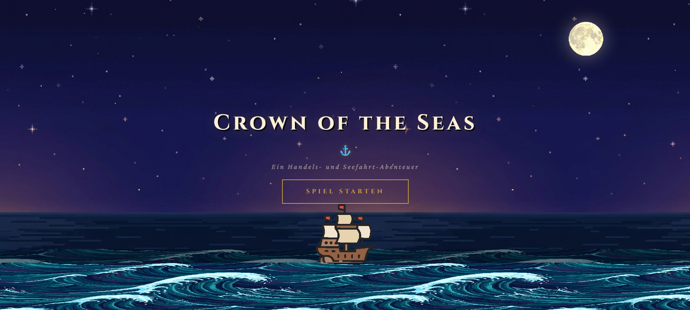{ width="98%" }

## Überblick

Die Weltmeere sind hart umkämpft. Wer am Ende gekrönt wird, herrscht nicht nur über die See, sondern beweist auch wirtschaftliches Geschick.

Crowns of the Seas ist in der Lehrveranstaltung Enterprise Applications entstanden und greift die Idee des Klassikers Ports of Call als Echtzeit-Multiplayer-Erlebnis für den Browser neu auf.
Im Mittelpunkt steht eine zugängliche Wirtschaftssimulation aus Handel, Logistik, Risiko und direkter Konkurrenz.
Das Ergebnis ist ein lauffähiges Mehrspieler-Spiel mit vollständiger Kernschleife.
Man kauft Schiffe, nimmt Aufträge an, transportiert Fracht über neun Häfen und versucht, am Ende das größte Vermögen zu besitzen.

## Ziele

Klassische Wirtschaftssimulationen sind oft Einzelspiel-Erlebnisse.
Gespielt wird gegen den Computer, in einer abgeschotteten Welt ohne echte Konkurrenz.
Crowns of the Seas verfolgt ein anderes Ziel, nämlich einen gemeinsamen Wettbewerb in Echtzeit.
Das Spiel richtet sich hauptsächlich an Menschen, die Aufbau- und Wirtschaftsstrategien mögen und dabei gegen echte Gegner:innen antreten wollen.
Für ein Informatik-Publikum ist es zugleich ein anschauliches Beispiel dafür, wie sich ein mehrspielerfähiges Echtzeit-Erlebnis im Browser umsetzen lässt.

Im Vordergrund standen folgende Ziele:

- Mehrere Spieler:innen sollen in einer geteilten Session aufeinandertreffen, mit gleichem Markt, gleichen Häfen und gleichen Ereignissen.
- Das Spielfeld soll fair sein, sodass alle unter exakt den gleichen Bedingungen antreten und niemand einen unfairen Vorteil hat.
- Die Wirtschaft soll sich glaubwürdig und spannend anfühlen, ohne dass vorher ein Handbuch gelesen werden muss.
- Das Spiel soll durch die Umsetzung von Minispielen, Sound, Animationen und direkter Kommunikation zwischen den Spieler:innen lebendig wirken.
- Das System soll erweiterbar bleiben, damit neue Fraktionen, Ereignisse oder Märkte später leicht ergänzt werden können.
- Das Spiel soll möglichst zugänglich sein, sodass es unabhängig von Erfahrung, Vorkenntnissen oder Hardware gespielt werden kann.

Das Projekt entstand innerhalb eines Semesters in einem Team aus vier Personen und sollte am Ende als lauffähiger Demonstrator im Browser spielbar sein.

## Spielkonzept & Funktionen

Im Kern der Herangehensweise steht das Spielerlebnis selbst. Es geht um eine geteilte Welt in Echtzeit, hinter der eine zugängliche Wirtschaftssimulation läuft.

### Spielprinzip & Besonderheiten

Mehrere Bausteine machen das Spiel besonders. Dazu gehören vor allem das echte Multiplayer-Erlebnis, die sieben Fraktionen und die Minispiele.

#### Geteilte Welt in Echtzeit

In einer geteilten Welt bewegen sich bis zu vier Reedereien über dieselbe Weltkarte mit neun Häfen, von Hamburg über New York bis Sydney.
Jeder Hafen hat ein eigenes Profil mit individuellem Aufbau und eigenen Merkmalen.
Das Profil lässt sich über die Karte öffnen und zeigt die wichtigsten Informationen zum Hafen auf einen Blick.

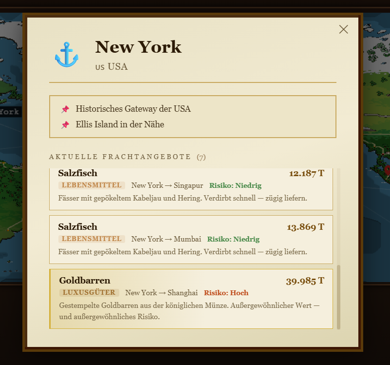{ width="98%" }

Die Schiffe der Konkurrenz sind jederzeit auf der Karte sichtbar, sofern man sie nicht bewusst ausblendet.
Ein synchronisiertes Zeitmodell mit einem Spieltag pro Tick sorgt dafür, dass alle im selben Rhythmus spielen und der Wettbewerb unmittelbar spürbar bleibt.

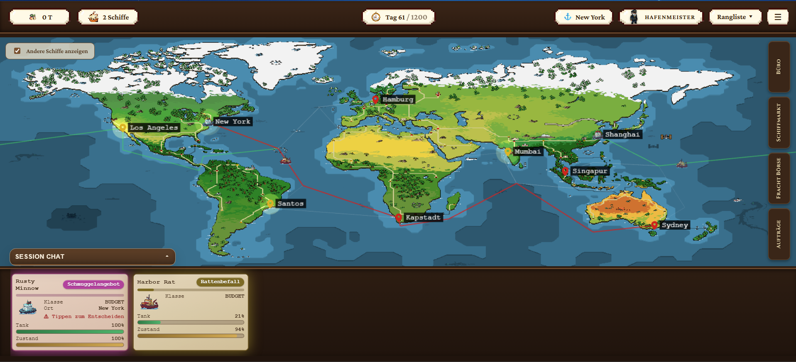{ width="98%" }

#### Frachtbörse

Geld verdient man, indem man Frachtaufträge annimmt und pünktlich abliefert.
Jeder Auftrag hat einen Herkunfts- und einen Zielhafen. Angenommen wird er nur im Herkunftshafen.
Wer zuerst die Fracht annimmt, bekommt sie auch. Zudem entscheidet der Frachttyp über die Strategie:

- **Verderbliche Ware** wie Lebensmittel muss schnell ankommen, sonst drohen hohe Abzüge durch den Regress.
- **Zerbrechliche Ware** leidet unter Unwettern unterwegs.
- **Luxusgüter** bringen die höchsten Belohnungen.

Von Luxusfracht gibt es höchstens zwei Aufträge gleichzeitig.
Sie bleiben so lange bestehen, bis jemand sie übernimmt.
Budget-Schiffe können sie allerdings nicht transportieren, da ihr Laderaum dafür nicht ausreicht.
Häfen, in denen gerade Luxusfracht wartet, leuchten auf der Karte golden auf.

Die Frachtbörse bündelt alle Aufträge eines Hafens und stellt sie übersichtlich dar.
Dort wird entschieden, welche Fracht mit welcher Geschwindigkeit angenommen wird.
Es gibt fünf Geschwindigkeitsstufen, die beeinflussen, wie viel Treibstoff verbraucht wird und wie lange eine Reise dauert.

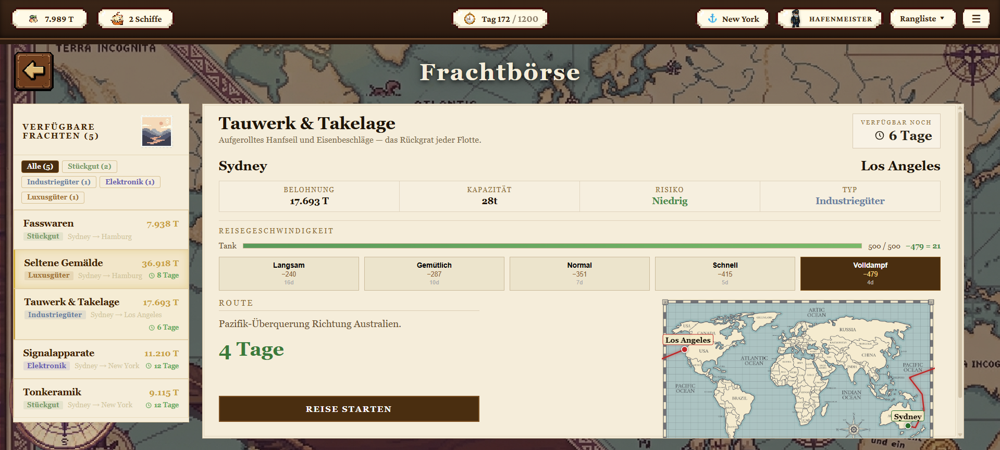{ width="98%" }

#### Leerfahrt

Eine Leerfahrt bringt keinen Gewinn, ist aber geeignet, wenn man beispielsweise zu einem Hafen mit Luxusfrachten kommen möchte.
Es wird keine Fracht transportiert, daher gibt es auch keine Belohnung.
Treibstoff wird dennoch verbraucht und der Zustand verschlechtert sich, weswegen eine Leerfahrt zu einem kleinen Verlust führt.

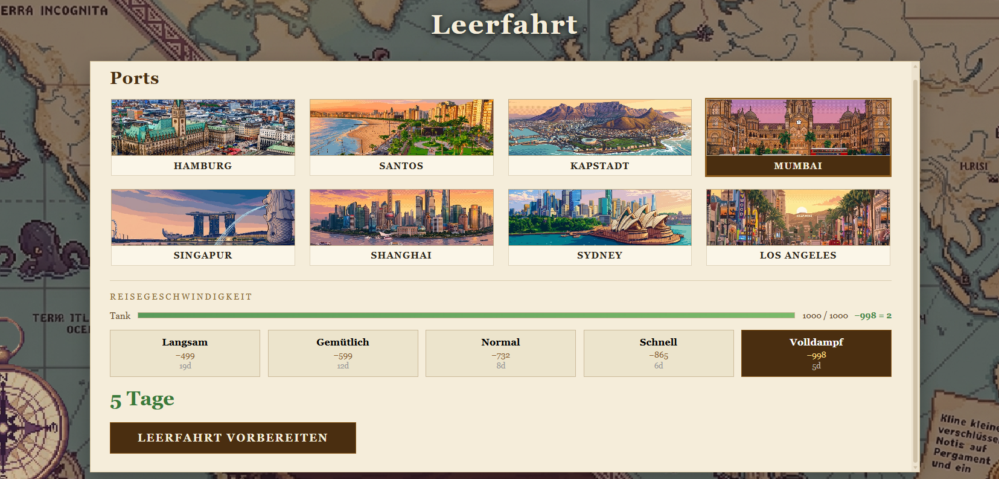{ width="98%" }


#### Schiffe und Flotte

Für die passende Flotte sorgt die Schiffsbörse mit drei Klassen:

- **Budget-Schiffe** sind günstig und eignen sich gut für den Einstieg.
- **Standard-Schiffe** sind ausgewogen.
- **Premium-Schiffe** sind teuer, aber leistungsstark.

Immer wieder tauchen zeitlich begrenzte Sonderangebote auf, bei denen Schiffe günstiger zu kaufen sind.

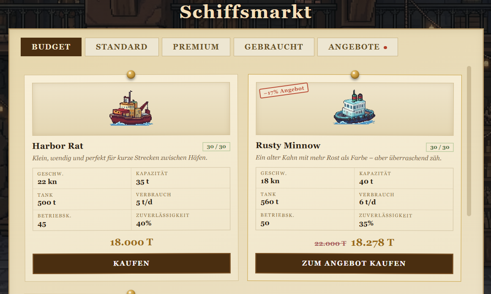{ width="98%"}

Die eigene Flotte wird im Büro verwaltet. Dort sieht man alle eigenen Schiffe und ihre aktuellen Aufgaben im Überblick.


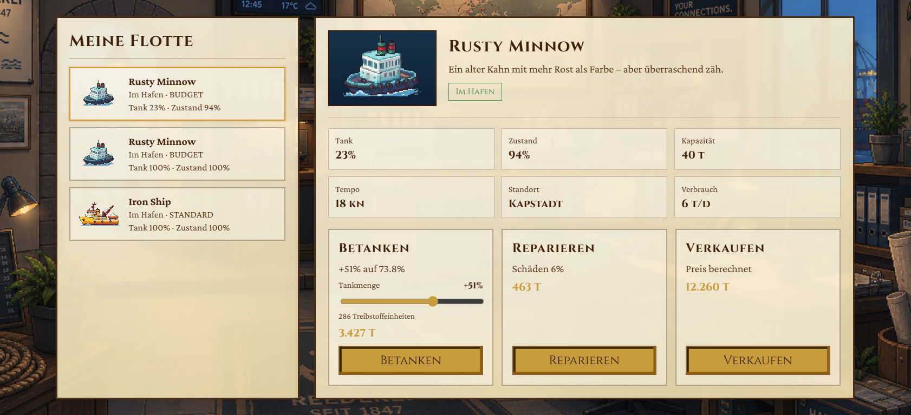{ width="98%"}

Zwischendurch müssen Schiffe betankt und repariert werden. Beides kostet Zeit und Taler und wird im Büro erledigt.
Beim Betanken lässt sich frei wählen, auf wie viel Prozent der Tank gefüllt wird.
Eine Reparatur setzt den Zustand dagegen immer vollständig zurück.
Schiffe lassen sich jederzeit kaufen und wieder verkaufen, wobei ein gepflegtes Schiff deutlich mehr einbringt.


#### Sieben Fraktionen

Eine zentrale Rolle spielen die sieben Fraktionen.
Schon zu Beginn wählt jede:r eine davon und legt damit die eigene Spielweise fest. Einige Beispiele:

- **Ingenieure** reparieren günstiger, brauchen dafür beim Be- und Entladen länger.
- **Händler** erhalten mehr und bessere Marktangebote, bekommen dafür aber seltener ein Schmuggelangebot.
- **Schmuggler** werden seltener vom Zoll erwischt, müssen aber mit mehr Ereignissen rechnen.

Es gibt keine beste Fraktion. Jede hat bewusste Stärken und Schwächen, was die Fraktionswahl zu einer strategischen Entscheidung macht.
Auf Fairness wurde dabei besonders geachtet.
Die Wahl gilt für das ganze Spiel, denn nach dem Spielstart lässt sich die Fraktion nicht mehr wechseln.

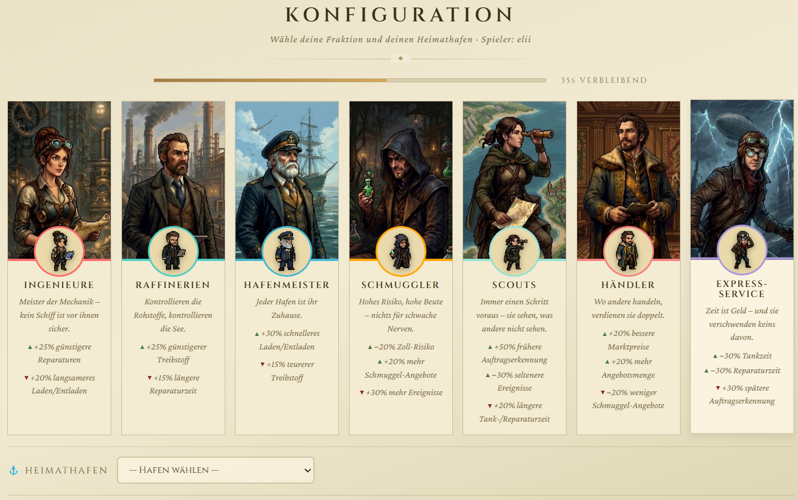{ width="98%" }

### Session und Lobby

Vor dem Spiel wird in der Lobby eine Session erstellt. Wer eine Session erstellt, wird zum Host und legt die Rahmenbedingungen fest:

- **Name:** der eigene Anzeigename in der Session.
- **Maximale Anzahl an Spieler:innen:** wie viele Reedereien gleichzeitig teilnehmen können.
- **Tickrate (Spieltempo):** wie schnell die Spielzeit vergeht. Eine langsamere Tickrate gibt mehr Zeit pro Entscheidung und macht das Spiel auch für Menschen mit Beeinträchtigungen oder langsamerer Wahrnehmung zugänglicher.
- **Spieldauer:** wie lange eine Session insgesamt läuft.

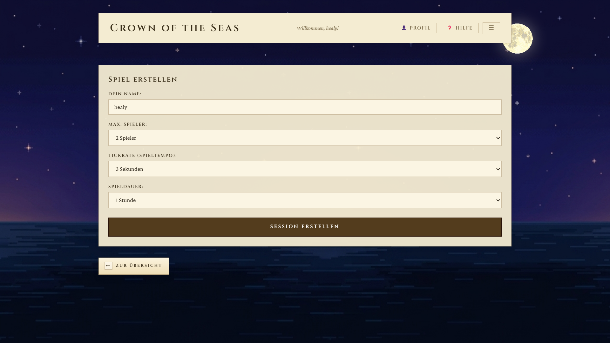{ width="98%" }

Einer bestehenden Session lässt sich auf zwei Wegen beitreten: über einen Beitrittscode oder über einen geteilten Link.

Nach dem Erstellen findet man sich zunächst in einem Warteraum wieder. Dort stehen der Beitrittscode und der Beitrittslink bereit, über die weitere Spieler:innen der Session beitreten können.
Zu Beginn ist der Host allein im Warteraum, bis nach und nach weitere Personen dazukommen.

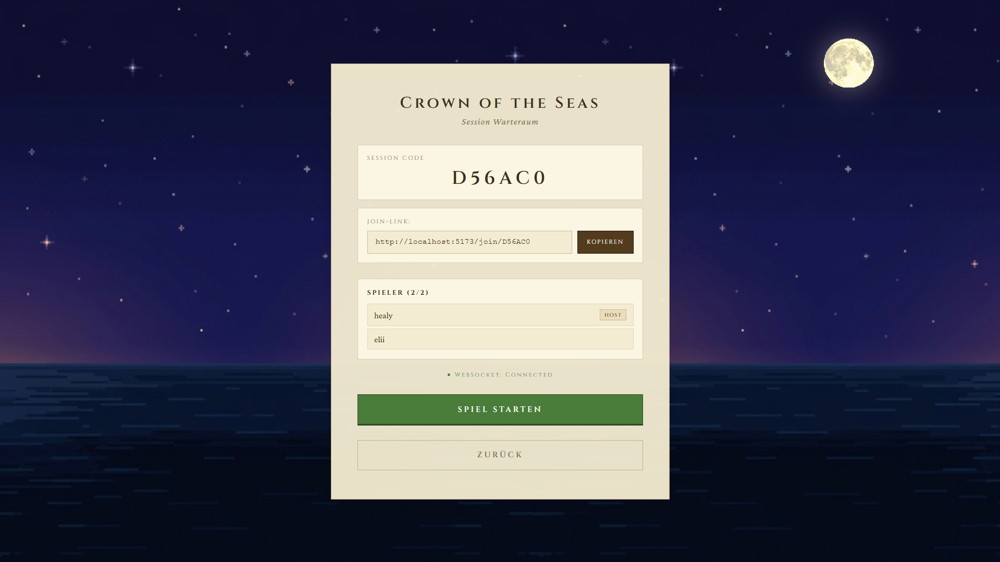{ width="98%" }

Verlässt jemand den Warteraum, wird die Person vollständig aus der Liste und der Session entfernt, sodass ihr Platz sofort wieder frei wird.

Der Host behält seine Rolle für die gesamte Session. Diese Rolle ist bewusst angelegt, damit host-gebundene Funktionen in zukünftigen Erweiterungen einen eindeutigen Host vorfinden.
Es muss daher zu jedem Zeitpunkt ein Host existieren. Verlässt der Host die Session, wird die nächste verbliebene Person automatisch zum neuen Host.

Eine Session lässt sich jederzeit verlassen, ohne dass das eigene Vermögen verloren geht, solange noch andere Spieler:innen in der Session sind.
Der eigene Spielstand bleibt erhalten. Verlässt die letzte Person die Session, wird sie beendet.

Solange eine Session aktiv ist, ist ein Wiederbeitritt jederzeit aus der Lobby möglich.
Beim Wiederbeitritt erhält man sein vorheriges Vermögen zurück. Die Spielzeit läuft währenddessen im Hintergrund weiter, sodass die Session für die übrigen Spieler:innen ununterbrochen fortläuft.
Anders als im Warteraum, wo ein frei werdender Platz sofort wieder vergeben wird, bleibt der Platz während eines laufenden Spiels für einen Wiederbeitritt reserviert.

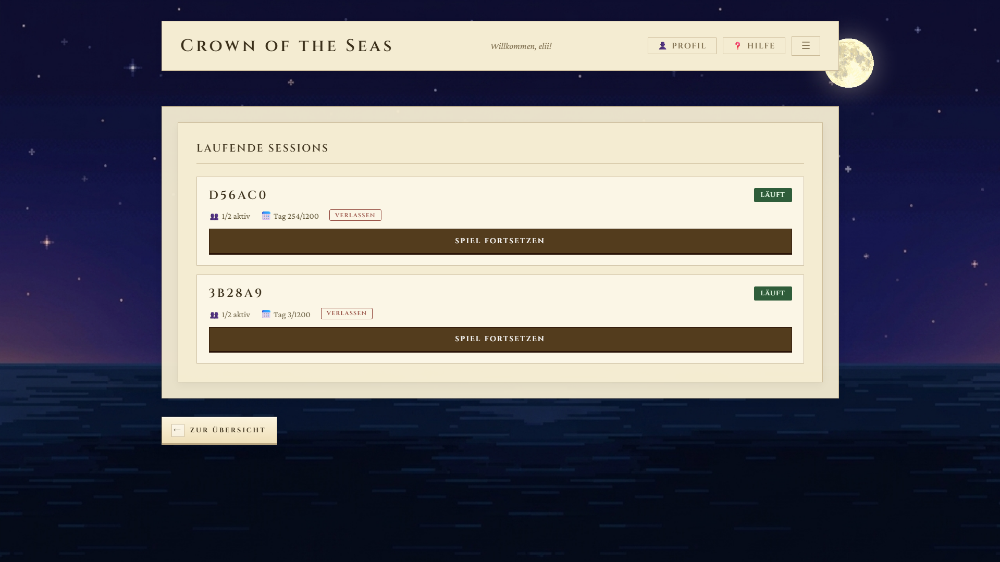{ width="98%" }

### Ereignisse & Minispiele

Eine Seereise verläuft nicht immer ruhig.
Während ein Schiff unterwegs ist, können verschiedenste Ereignisse auftreten.
Wenn es dazu kommt, wird die Reise pausiert und es gilt, ein kleines Minispiel zu meistern.
Wer besteht, fährt ohne Schaden weiter. Wer jedoch scheitert, verliert einen Teil der Fracht, nimmt Schaden oder bekommt einen Teil der Belohnung abgezogen.
Diese Minispiele geben jeder Fahrt ihre eigene Spannung:

- Der **Sturm auf See** lässt ein Unwetter aufziehen und Blitze schlagen ins Wasser. Das Schiff lässt sich nach links und rechts lenken, um Sonnen einzusammeln und den Blitzen auszuweichen. Jeder Treffer kostet Haltbarkeit.
- Der **Rattenbefall** bringt Ratten an Bord. Mit der Maus werden sie nacheinander angeklickt, bevor die Zeit abläuft. Andernfalls fressen sie einen Teil der Ladung an.
- Die **gefährliche Passage** führt durch ein enges Fahrwasser voller Hindernisse. Das Schiff lässt sich frei in alle Richtungen steuern. Jede Kollision beschädigt es.
- Die **Schatzjagd** ist freiwillig. Wer der Spur folgt, steuert durch ein Labyrinth aus Seewegen, sammelt Schätze ein und weicht Piraten aus. Bei Erfolg gibt es eine zusätzliche Belohnung. Wenn die Schatzjagd nicht erfolgreich abgeschlossen wird, geht ein Teil der Fracht verloren.

{ width="98%" }

Zwei weitere Ereignisse sorgen für zusätzliche Spannung.
Beim Lotsenstreik fällt der automatische Lotsendienst aus, sodass das Steuern beim An- und Ablegen selbst übernommen werden muss.

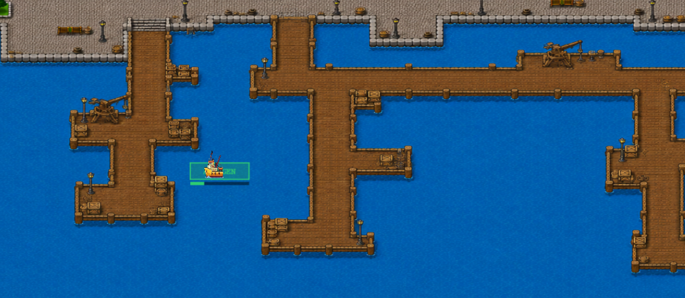{ width="98%" }

Wer beim Auslaufen ein Schmuggelangebot annimmt, kann gegen eine zusätzliche Belohnung illegale Ware mitnehmen, riskiert im Zielhafen aber eine Zollkontrolle. Wird sie entdeckt, bleibt die Wahl zwischen einer Strafe und dem Versuch, den Zoll zu bestechen.

### Nutzungserlebnis

Da im Hintergrund eine echte Simulation läuft, ist das Spiel bewusst zugänglich, einladend und reaktiv gestaltet.
Es steht immer Hilfe bereit, wo sie gebraucht wird.

Bereits der Einstieg sorgt für eine einladende Atmosphäre.
Eine Startanimation führt in die Welt ein. Auch das Ablegen und der Game-Over-Bildschirm mit Siegespodest sind animiert.

{ width="98%" }

#### Tutorial & Help Center
Für einen leichten Einstieg sorgt ein geführtes Tutorial in der Lobby, das die wichtigsten Abläufe vor dem ersten Spiel zeigt.
Wer später etwas nachschlagen möchte, kann jederzeit das integrierte Help Center öffnen, in dem alle Spielmechaniken nach Kapiteln gegliedert sind.
Neben dem Gesamttutorial gibt es kürzere Einzeltutorials zu Reise, Leerfahrt, Reiseabschluss, Wartung und Luxusfrachten, die sich gezielt und jederzeit erneut starten lassen.
Ein Tutorial lässt sich außerdem jederzeit beenden. So findet sich jede:r auch ohne Vorwissen im Spiel zurecht, und die Spielregeln bleiben transparent.

{ width="98%" }

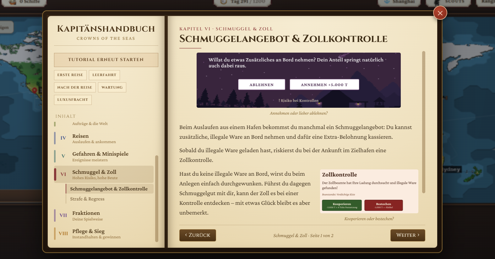{ width="98%" }

Visuelle Hinweise nehmen den Spieler:innen das Suchen ab.
Eine Schiffskarte leuchtet auf und erhält einen farbigen Rahmen, sobald eine Entscheidung ansteht. Dabei wurde darauf geachtet, dass dies kein alarmierendes Gefühl erzeugt.
Häfen mit Luxusfracht leuchten golden. Hält man die Maus über einen Button oder einen Hafen, werden die wichtigsten Informationen kurz eingeblendet.

Dazu kommen viele kleine Elemente, die das Nutzungserlebnis nochmals verbessern:

- Ein In-Game-Chat erlaubt die direkte Kommunikation zwischen Spieler:innen einer Lobby.
- Ein Leaderboard zeigt jederzeit Vermögen und Platzierung.
- Auch nach einem unbeabsichtigten Verbindungsabbruch ist ein sauberer Reconnect möglich.
- Musik und Soundeffekte begleiten die Wechsel zwischen Lobby, Spiel und Minispielen. Lautstärke und Stummschaltung lassen sich getrennt für Musik und Effekte einstellen.
- Das Spiel lässt sich jederzeit in den Vollbild-Modus schalten, was Weltkarte und Minispiele besser zur Geltung bringt und Ablenkungen außerhalb des Spiels ausblendet.

### Spielende und Platzierung

Am Ende einer Session gibt es eine Abrechnung. Da es sich um ein Wirtschaftsspiel handelt, geht es hier um das höchste Vermögen.
Ein animierter Game-Over-Bildschirm zeigt das Siegespodest und die Platzierung aller Reedereien.

{ width="98%" }

Die Platzierung im Leaderboard folgt einem klaren Prinzip. Gezählt wird das gesamte Vermögen einer Reederei.
Es setzt sich aus den Talern auf dem Konto und dem Wert aller eigenen Schiffe zusammen.
Der Wert eines Schiffs richtet sich nach seinem Grundpreis sowie nach Zustand und Tankfüllung.

Eine wichtige Regel betrifft laufende Reisen. Gewinn wie auch Verlust einer Fracht werden erst verrechnet, wenn das Schiff im Zielhafen angekommen ist.
Eine Reise, die zum Spielende noch unterwegs ist, fließt somit weder als Gewinn noch als Verlust in das Vermögen ein. Das hält die Abrechnung für alle fair.

Das Spielende kündigt sich rechtzeitig an. Sind nur noch zehn Prozent der Spielzeit übrig, erscheint eine erste Warnung, bei den letzten fünf Prozent eine zweite, deutlichere.
So kann jede:r die verbleibende Zeit einschätzen und letzte Reisen planen.

### Adminseite

Das Spiel lässt sich außerdem über eine geschützte Administrationsseite anpassen, ohne dass in den Code eingegriffen werden muss.
Mit einem eigenen Admin-Zugang können dort zum Beispiel die verfügbaren Frachten und Schiffe konfiguriert werden.
So kann das Spiel an Betreiber:innen übergeben werden, die Inhalte und Werte selbst einstellen können.

Die ersten Daten sind im Code hinterlegt und stehen direkt beim Start bereit.
Danach kann der Admin sie jederzeit bearbeiten, löschen oder neu anlegen.

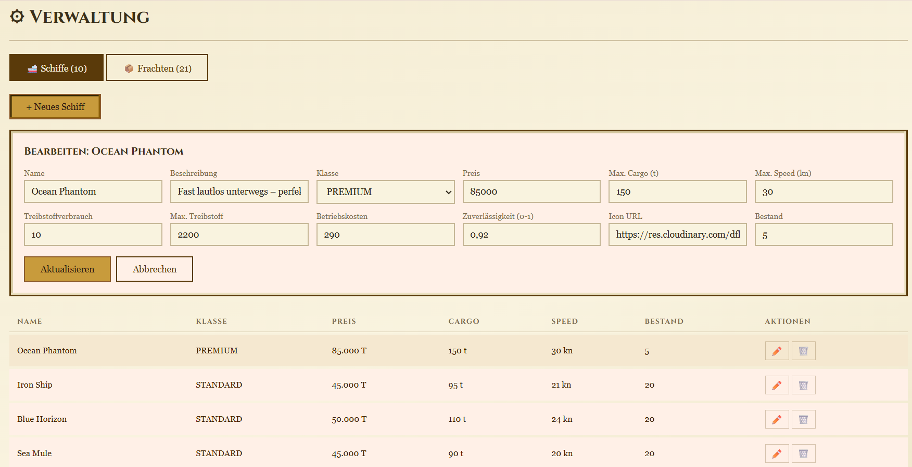{ width="98%" }

### Lebenszyklus eines Schiffs

Wie viel Detail in der Simulation steckt, zeigt der Lebenszyklus eines einzelnen Schiffs.
Es befindet sich zu jedem Zeitpunkt in genau einem klar definierten Zustand.
Dieser Zustand wechselt je nach Spielgeschehen, etwa vom Hafen über die Reise bis zum Anlegen.

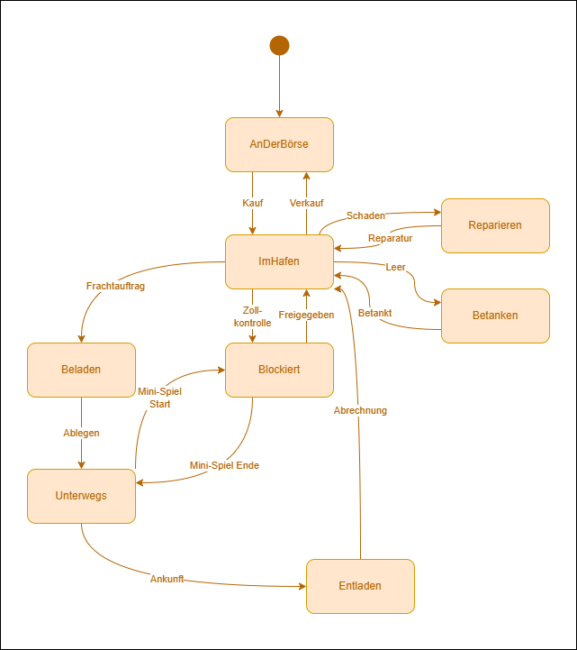{ width="98%" }

## Umsetzung

Bei der Umsetzung stand die Entscheidung im Vordergrund, welche Technologien das Erlebnis am besten unterstützen.
Die gesamte Spiellogik läuft serverseitig und wird über WebSocket an alle Clients verteilt. So bleibt die geteilte Welt in Echtzeit zusammen.

| Bereich | Technologien |
|---|---|
| Oberfläche | React und TypeScript, Phaser für Weltkarte und Minispiele |
| Spielserver und Anmeldung | Java mit Spring Boot, Echtzeit über WebSocket, Anmeldung per JWT |
| Datenhaltung | PostgreSQL |
| Build und Betrieb | Docker, automatisierte CI/CD-Pipeline, Unit- und Integrationstests |

Bewusst wurde auf eine stark in Microservices aufgeteilte Architektur verzichtet.
Das Spiel braucht einen gemeinsamen, konsistenten Spielzustand in Echtzeit und dafür ist ein zusammenhängender Spielserver einfacher sowie performanter umzusetzen.
Viele kleine Prozesse hätten zusätzlichen Kommunikations- und Synchronisationsaufwand verursacht, der im Rahmen des Projekts keinen wesentlichen Mehrwert geboten hätte und bei einem zeitkritischen Spiel nachteilig wäre.

Einige Grundsätze prägen die Architektur:

- Die Spiellogik läuft auf dem Server und nicht im Browser. Alle wichtigen Entscheidungen, Marktbewegungen und Zufallsereignisse werden zentral berechnet und geprüft. So sehen alle denselben Spielzustand, und Manipulationen sind praktisch ausgeschlossen.
- Statt ständig nachzuladen, erhalten die Clients Schiffspositionen, Marktänderungen und Ereignisse aktiv zugeschickt. Dadurch wirkt die geteilte Welt unmittelbar und flüssig.
- Die Anmeldung ist ein eigener Service und von der Spiellogik getrennt. Das erhöht die Sicherheit und hält das System übersichtlich.
- Die Architektur selbst ist in Schichten unterteilt, damit Packages besser getestet werden und die Teamarbeit erleichtert wird.

Zudem wurde das Verhalten mit Unit- und Integrationstests überprüft, wodurch einige Fehler entdeckt werden konnten.

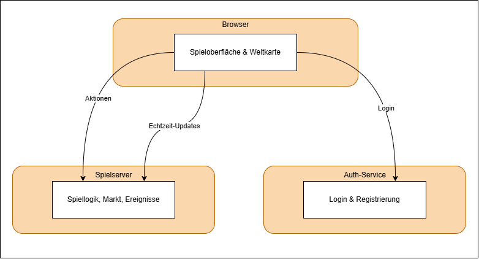{ width="80%" }

Die Routen zwischen den Häfen berechnet das Spiel automatisch als kürzesten Seeweg mit dem A*-Algorithmus.
Über eine Heuristik, die Luftlinie zum Zielhafen, schätzt der Algorithmus die verbleibende Distanz und untersucht zuerst die vielversprechendsten Wege.
Die Karte läuft dabei am Rand nahtlos um. Ein Schiff kann also am rechten Kartenrand verschwinden und links wieder auftauchen.

### Fraktionen über das Decorator-Pattern

Damit sich die sieben Spielstile sauber und fair umsetzen lassen, beruht das Fraktionssystem auf dem Decorator-Pattern.
Es gibt ein neutrales Grundverhalten einer Reederei. Jede Fraktion ist ein Dekorierer, der dieses Grundverhalten umhüllt und nur die für sie wichtigen Werte anpasst.
Die Ingenieure senken zum Beispiel die Reparaturkosten und verlängern zugleich die Ladezeit.
Dieser Ansatz sorgt für gute Skalierbarkeit, eine klare Trennung der Zuständigkeiten und einfache Kombinierbarkeit.
Eine neue Fraktion bedeutet damit einen neuen Dekorierer, ohne dass bestehender Code angefasst werden muss.

Konkret sieht ein solcher Dekorierer am Beispiel der Ingenieure so aus:

```java
public class EngineerDecorator extends SessionPlayerDecorator {

    public EngineerDecorator(ISessionPlayer wrappedPlayer) {
        super(wrappedPlayer);
    }

    @Override
    public double getRepairCostModifier() {
        return 0.75;   // Reparatur günstiger
    }

    @Override
    public double getLoadingTimeModifier() {
        return 1.20;   // dafür längere Ladezeit
    }

    @Override
    public double getUnloadingTimeModifier() {
        return 1.20;   // und längere Entladezeit
    }
}
```

Jede Fraktion überschreibt nur die für sie relevanten Modifikatoren.
Das neutrale Grundverhalten liefert jeweils den Wert `1.0`, sodass ein nicht überschriebener Modifikator den Standard unverändert lässt.

## Ergebnisse & Evaluation

Crowns of the Seas ist als vollständiges Multiplayer-Spiel spielbar. Die gesamte Kernschleife, vom Frachtmarkt über den Schiffshandel bis zur Reise mit Abrechnung im Zielhafen, wurde erfolgreich abgeschlossen.

Über die geplante Grundversion hinaus sind viele Besonderheiten entstanden, die das Spiel ausmachen:

- die sieben Fraktionen mit eigenen Stärken und Schwächen
- die vier geschicklichkeitsbasierten Minispiele
- der Schmuggel mit Zollkontrolle und Bestechung
- die Startanimation und der animierte Game-Over-Bildschirm
- das Help Center und das Tutorial für einen leichten Einstieg
- die Möglichkeit, im Vollbild-Modus zu spielen
- die Administrationsseite zur freien Konfiguration von Frachten und Schiffen

Besonderer Wert lag auf einem stimmigen Spielerlebnis und darauf, die Spieler:innen in die Welt einzubeziehen.
Genauso wichtig war ein leichter Einstieg, der das Spiel für möglichst viele Menschen zugänglich macht.
Auch die Fraktionen wurden bewusst fair gestaltet. So entsteht strategische Vielfalt, ohne dass jemand benachteiligt wird.

## Herausforderungen & Lerneffekte

Eine erste Herausforderung war die Performance, da es anfangs oft zu Verzögerungen kam.
Bei mehreren gleichzeitigen Sessions wurde das Backend zum Engpass, da pro Tick dieselben Daten redundant aus der Datenbank geladen wurden. So kam es zu über 30 Abfragen pro Tick.

Folgende Optimierungen haben das gelöst:

- **TickContext:** Alle Daten einmal am Tick-Anfang laden und an alle Methoden weitergeben.
- **Statisches Caching:** Unveränderliche Daten wie Häfen und Schiffsvorlagen einmalig in den Speicher laden.
- **Transaktion pro Tick:** Alle Lese- und Schreibvorgänge in einer Transaktion bündeln statt in einzelnen.
- **Batch-Saves:** Geänderte Entities gesammelt am Tick-Ende speichern statt einzeln.

Das Ergebnis war die Reduktion von über 30 auf etwa sechs Datenbankabfragen pro Tick.

Die anspruchsvollste Aufgabe war die Echtzeit-Konkurrenz. Mehrere Clients müssen jederzeit denselben Spielzustand sehen.
Die Logik wird daher vollständig auf dem Server berechnet und Änderungen werden aktiv an die Clients übertragen.
Dieser Ansatz hat sich bewährt und sorgt zugleich für Fairness sowie Reaktivität.

Außerdem stellte die Darstellung auf der Karte eine Herausforderung dar.
Die exakte Positionierung von Schiffen und Häfen in Phaser erforderte einigen Aufwand.
Zusätzlich war die Wahl der passenden Architektur schwierig, da die Aufgabenstellung bewusst offen gehalten war und der geeignete Ansatz selbst entwickelt werden musste.

Drei Erkenntnisse bleiben besonders hängen.
Fairness und ein leichter Einstieg sind keine zusätzlichen Features, sondern entscheidend dafür, ob sich alle eingeladen fühlen mitzuspielen.
Sie sollten daher bei neuen Features stets mitgedacht werden.
Eine durchdachte Architektur zahlt sich aus, da das Decorator-Pattern das Hinzufügen neuer Fraktionen deutlich vereinfacht hat.
Und gerade eine nüchterne Simulation lebt von gutem Feedback. Erst visuelle und akustische Rückmeldungen machen das Spiel zugänglich und lebendig.

## Ausblick

Die geplanten Funktionen sind vollständig umgesetzt. Für die Zukunft sind weitere Ausbaumöglichkeiten denkbar:

- Kredite und Hypotheken, die den wirtschaftlichen Wettbewerb noch einmal verschärfen würden
- ein optionaler Computergegner für das Spiel allein oder zum Üben
- weitere Fraktionen und Minispiele für noch mehr Abwechslung


## Links & Ressourcen
- Download: [Crowns of the Seas (ZIP)](assets/crowns-of-the-seas.zip)
- Repository: [github.com/a-helena19/Crowns-Of-The-Seas](https://github.com/a-helena19/Crowns-Of-The-Seas)
- Live-Demo: [Link](http://10.0.40.186)

  {width=160px}
- Spielmusik: [„Pirate Music" von Alex Nachtmahr](https://youtu.be/bKlQZ8rSqGg?si=rsRPDT_2_Au0beWe) (YouTube)
- Soundeffekte & Hintergrundmusik: [Pixabay](https://pixabay.com)
- Fraktions-Charaktere: Generiert mit [Gemini](https://gemini.google.com)
- Sailor-Charakter: [SpriteStudio Gallery](https://spritestudio.dev/gallery)
- Minigame-Bilder: Generiert mit dem [ChatGPT Bildgenerator](https://chatgpt.com)
- Weltkarte: Basierend auf einer [Vorlage von r/MapPorn](https://www.reddit.com/r/MapPorn/comments/q7h8hi/corrected_map_of_the_world_in_the_style_of_super/) (Reddit)
- Übrige Grafiken: Generiert mit Gemini und ChatGPT